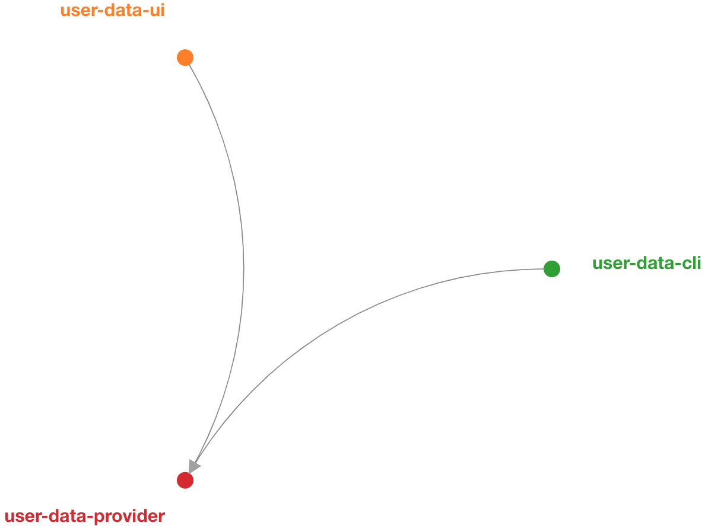
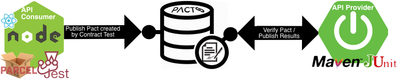
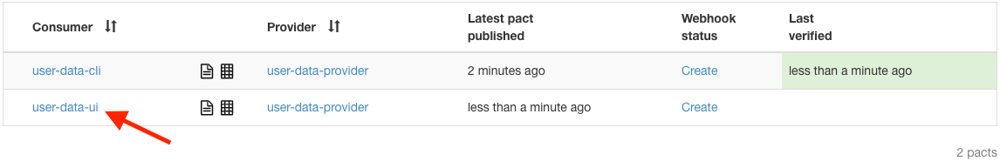
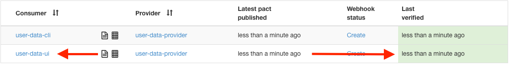
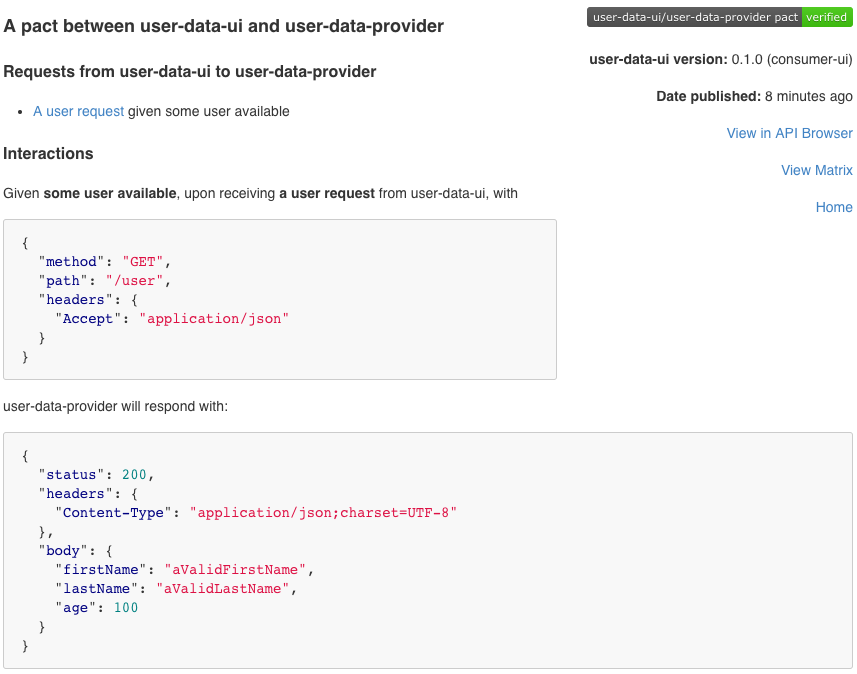

# Pact Example [](https://travis-ci.org/christian-draeger/pact-example)

This is an example project to give an overview about **Consumer Driven Contract Testing**.

## Table of Contents
* [Prolog](#prolog)
	* [Effective test suites with short feedback loop](#effective-test-suites-with-short-feedback-loop)
	* [The problem with E2E integration testing](#the-problem-with-e2e-integration-testing)
* [Intro to Consumer Driven Contract Testing](#intro-to-consumer-driven-contract-testing)
* [What?](#what)
* [Intro to Pact](#intro-to-pact)
	* [The Motivation](#the-motivation-of-this-example-implementations)
	* [REST](#rest-example-server-to-server-communication)
		* [Consumer](#the-consuming-application)
			* [Defining a Pact](#defining-a-pact)
				* [Define](#define)
				* [Test](#test)
				* [Publish](#publish)
					* [Pact Broker intro](#the-broker)
					* [Broker Setup with docker-compose](#broker-setup-with-docker-compose)
					* [Upload contract to broker](#upload-contract-to-broker)
			* [Best Practices](#best-practices-(on-consumer-side))
		* [Producer / Provider](#the-providing-application)
			* [Verify a Pact](#verify-a-pact)
				* [Test](#verification-test)
			* [Best Practices](#best-practices-(on-producers-side))
	* [Javascript Consumer](#javascript-consumer)
		* [Define](#define-1)
		* [Test](#test-1)
		* [Publish](#publish-1)
	* [Spring Cloud Contract meets Pact](#spring-cloud-contract-meets-pact)
	* [Messaging](#messaging-example)
	* [Extra infos on Pact](#extra-infos-on-pact)
* [Helpful links](#helpful-links)

## Prolog

> When setting up a continuous deployment pipeline for any project, having a purposeful testing plan is of utmost importance.

### Effective test suites with short feedback loop

An _effective_ test suite includes a combination of _testing strategies_ that leads to high test coverage, 
that in turn drives _confidence_. 
These strategies are typically in the form of unit, component, integration and acceptance tests. 
Monitoring and alerting too.

The test suite needs to run wicked **_fast_**, and be **_reliable_**. 
This cannot be stressed enough. If tests are flakey (i.e. often return false negatives or positives) 
it cannot be depended on to give us the desired confidence that we need.

Tests also need to run as early as possible in the continuous deployment pipeline to **_shorten the 
feedback loop_** for the developer. So ideally, most tests should be designed to run when pull requests 
are built (on standalone build agents that are sandboxed from the application environment). 
To achieve this requirement, tests must make no assumption about the availability of any of its 
external dependencies, and be designed to run in **_isolation_**.

Tests that are designed to be fast, reliable and isolate failure will have a short and 
effective feedback loop that informs the developer with confidence whether the product is working or not.

### The problem with E2E integration testing

Unit tests is a good example of one such testing process that achieves the desired effectiveness 
being aspired to — they are fast, reliable and isolate failure. 
However, unit tests on their own are not enough because they give no guarantee that the tested 
units work well together.

In the absence of the perfect unit test suite, end-to-end (E2E) integration tests are typically 
the testing strategy of choice that is used to try and ascertain confidence in the system working 
as a whole.

Even though E2E tests are full of promise to assert the overall product working a whole 
from a user’s perspective, they [quickly become a very bad idea](https://blog.thecodewhisperer.com/permalink/integrated-tests-are-a-scam) 
because of their [awful feedback loop](https://testing.googleblog.com/2015/04/just-say-no-to-more-end-to-end-tests.html) — slow, unreliable and depend on too many things at once.

### Intro to Consumer Driven Contract Testing

An alternative testing strategy that complements the deficiency of unit tests but verifies that 
components with external dependencies work together is integration contract testing.
The [concept](https://www.martinfowler.com/articles/consumerDrivenContracts.html) isn’t new, 
but with the mainstream acceptance of microservices, 
it's important to remind people that consumer-driven contracts are an essential 
part of a mature microservice testing portfolio, enabling independent 
service deployments.

When two independently developed services are collaborating, 
changes to the supplier’s API can cause failures for all its consumers. 
Consuming services usually cannot test against live suppliers since such 
tests are slow and brittle, so it’s best to use Test Doubles (mocks), 
leading to the danger that the test doubles get out of sync with the real 
supplier service. Consumer teams can protect themselves from these failures 
by using integration contract tests – tests that compare actual service 
responses with test values. While such contract tests are valuable, 
they are even more useful when consuming services provide these tests to 
the supplier, who can then run all their consumers’ contract tests to determine 
if their changes are likely to cause problems.

Contract testing is immediately applicable anywhere where you have two 
services that need to communicate - such as an API client and a web front-end
or for instance to services communicating via messaging queues. 
Although a single client and a single service is a common use case, 
contract testing really shines in an environment with many services 
(as common for a microservice architecture). 
Having well-formed contract tests makes it easy for developers to avoid 
version hell. Contract testing is the killer app for microservice development and deployment.

In general, a contract is between a consumer (for instance a client that wants 
to receive some data) and a provider (for instance an API on a server that 
provides the data the client needs). In microservice architectures, 
the traditional terms client and server are not always appropriate -- for example, 
when communication is achieved through message queues (we'll have a look at this as well).

#### Benefits in short
* enable services to be deployed independently
* enables teams to work independently from each other
* enables verification of external endpoints - am i building what is wanted?

### Intro to Pact


[Pact](https://docs.pact.io) is a consumer-driven contract testing tool. 
This means the contract is written as part of the consumer tests. 
A major advantage of this pattern is that only parts of the communication 
that are actually used by the consumer(s) get tested. 
This in turn means that any provider behaviour not used by current consumers 
is free to change without breaking tests.

Pact enables consumer driven contract testing, 
providing a mock service and DSL for the consumer project, 
interaction playback and verification for the service provider project.


The Pact family of testing frameworks 
(Pact-JVM, Pact Ruby, Pact .NET, Pact Go, Pact.js, Pact Swift etc.) 
provide support for Consumer Driven Contract Testing between dependent systems 
where the integration is based on HTTP (or message queues for some of the implementations).


### the motivation of this example implementations
Because [Pact](https://docs.pact.io/) is supporting so much languages and different ways of doing things and 
they have a distributed documentation it can get messy and a bit annoying to search 
or better say filter for the information you particularly want / need.
Only for the JVM there are currently ~20 different extensions / dependencies (plugins not included). 🤯

>_**In my opinion it's absolutely awesome to get decent support for different languages and frameworks,
>but it can become quite hard to keep track of all the already existing stuff (especially if you're a newbie to Pact).**_

For this reason I decided to write a compact step by step guide with working examples
using Maven as build tool and provide each a Kotlin and a Java example of the test implementation.
(😏 and a Javascript Consumer implementation)

## What? 

What's going on here (in short):
* Test implementation examples: 
	* Consumer: Kotlin, Java, Javascript
	* Producer: Kotlin and Java
* Contract repository: [Pact Broker](#publish)
	* via docker-compose
* Functional API tests: WireMock
* Build-tool: Maven

Included examples are: How to test services that are talking REST as well as examples
regarding how to ensure your services that are communication via messaging providing data in the 
correct format (from the consumers point of view).   

The **REST-Example** includes two applications where one is acting as a producer 
(webservice with rest endpoint) and a consumer 
(a CLI app that prints data received from the producer to console if executed).

Both of the applications (producer and consumer) are testing there-self.
The Consumer-Apps dependencies (having the Producer-App available, 
a working internet connection and getting a suitable response) can be detached by
mocking (e.g. WireMock) to run locally and independent.
Great!!! so far so good.
We want go a step further and decouple the release cycles of our microservices.

##### But how to make sure the Producers (supplier) response is in a Suitable format for the Consumer?

🤝 In a good relationship we know what to expect from each other and so should our services do.

#### Let's make a _Pact_

What is a Pact? 🤷‍

> A formal agreement between individuals or parties.
Synonyms: agreement, protocol, deal, contract 
>>~ Oxford Dictionaries​

In Terms of Contract Testing you should always proceed according to the following schema when implementing a Pact:

* Start implementing on the Consumer side
	* define your contract
	* verify your contract against a mock
	* publish your contract
* End up verifying the contract on Producer side

> **_A few words in advance:_** 
>> Don't get confused by the Consumer / Producer wording - it is not related to the data flow!
>> Producer in the context of Pact describes who is providing the API.
>> That means for instance if you make a POST-request to an API - the API providing application is the _Producer_, where the application that is doing the request is the _Consumer_ on the other hand.


Regarding the example implementations we will focus on the **[HTTP based integration](#rest-example-server-to-server-communication) first** and _later on_ we having a look at [**messaging queues**](#messaging-example).

# REST Example (Server to Server communication)


###### The Consuming Application
## Defining a Pact
Defining a Pact should be splitted into 3 steps:
* [Define](#define)
* [Test](#test)
* [Publish](#publish)

> If you are looking for an example on how to define a contract by using Javascript go [here](#javascript-consumer).  

### Define
We'll start defining our Pact at the **Consumer** Application. 
I mean hey, we want to work Consumer Driven and who could know its 
requirements regarding a producer API better then the Consumer itself?

#### prerequisites on consumer side
First let's add the relevant **Pact** dependency for our use-case to the consumer applications *pom.xml*.
I'm using the [pact-jvm-consumer-java8](https://github.com/DiUS/pact-jvm/tree/master/pact-jvm-consumer-java8) dependency here _(an extension for the pact DSL provided by [pact-jvm-consumer](https://github.com/DiUS/pact-jvm/blob/master/pact-jvm-consumer))_ because it
provides a nice lambda based DSL for use with Junit to build consumer tests.

``` xml
<dependency>
	<groupId>au.com.dius</groupId>
	<artifactId>pact-jvm-consumer-java8_2.12</artifactId>
	<version>3.5.21</version>
	<scope>test</scope>
</dependency>
```

Now we are able to define how the **Producer** APIs response needs to look like from the **Consumers** point of view.
We'll begin by creating a test class named `ContractTest` that implements `ConsumerPactTestMk2`.

You'll need to implement `providerName()`, `consumerName()`, `createPact()` and `runTest()`.

The implementation of the `providerName()` method should return a string that describes the name of the provider API.
Since our **Provider** is responsible for user data we should call it something like "user-data-provider":

> using kotlin
>``` kotlin
>override fun providerName(): String = "user-data-provider"
>```

> using java
>``` java
>@Override
>protected String providerName() {
>	return "user-data-provider";
>}
>```

The implementation of the `consumerName()` method should return a string that describes the name of the consuming service.
Since our **Consumer** is an cli-tool that displays user data we should call it something like "user-data-cli":

> using kotlin
>``` kotlin
>override fun consumerName(): String = "user-data-cli"
>```

> using java
>``` java
>@Override
>protected String consumerName() {
>	return "user-data-cli";
>}
>```

> **Hint:** Don't test (worst-case scenario) all fields or HTTP status codes the Provider API supports with Pact. You don't want to break the Providers build on every change that's made over there (for instance if something changed that wouldn't influence the behavior on Consumer Apps side). Just be tide on the things the Consumer App really expects from the Provider API.

> **Take away:** To verify how your Producer Client behaves on scenarios like network errors or getting crappy data from the API you should use WireMock.

Now let's define how a request from the **Consumer** looks like and what's the 
expected format of the payload by implementing the `createPact()` method.

We are using the `PactDslWithProvider` builder to describe the request 
and (because we are expecting a response with a JSON body)
the `PactDslJsonBody` builder to define the payload:

> using kotlin:
>``` kotlin
>override fun createPact(builder: PactDslWithProvider): RequestResponsePact {
>
>	val body = PactDslJsonBody()
>			.stringType("firstName")
>			.stringType("lastName")
>			.numberType("age")
>			.`object`("ids", PactDslJsonBody()
>					.integerType("id")
>					.uuid("uuid"))
>
>	return builder.uponReceiving("can get user data from user data provider")
>			.path("/user")
>			.willRespondWith()
>			.status(200)
>			.body(body)
>			.toPact()
>}
>```

> using java:
>``` java
>@Override
>protected RequestResponsePact createPact(PactDslWithProvider builder) {
>	PactDslJsonBody body = new PactDslJsonBody()
>			.stringType("firstName")
>			.stringType("lastName")
>			.numberType("age")
>			.object("ids", new PactDslJsonBody()
>				.integerType("id")
>				.uuid("uuid")
>			);
>
>	return builder.uponReceiving("can get user data from user data provider")
>			.path("/user")
>			.method("GET")
>			.willRespondWith()
>			.status(200)
>			.body(body)
>			.toPact();
>}
>```

### Test
At this point we should define our client-side test based on the defined request we
described in the step before. So let our *UserClient* (that is talking to the **Provider**)
call a mockServer (that is created for us by **Pact**) as we defined it in our `createPact()` implementation.  

>using kotlin:
>``` kotlin
>override fun runTest(mockServer: MockServer) {
>   val expectedKeys = listOf("firstName", "lastName", "ids", "age")
>   val result = UserClient("${mockServer.getUrl()}/user").callProducer()
>   assertThat(result.keys).containsAll(expectedKeys)
>}
>```

>using java:
>``` java
>@Override
>protected void runTest(MockServer mockServer) {
>    List<String> expectedKeys = Arrays.asList("firstName", "lastName", "ids", "age");
>    Map<String, String> result = new UserClient(mockServer.getUrl() + "/user").callProducer();
>    assertThat(result.keySet()).containsAll(expectedKeys);
>}
>```

> ##### So your test class should look something like [THIS](consumer/src/test/kotlin/com/example/demo/ContractTest.kt) if you are using Kotlin afterwards.
> ##### So your test class should look something like [THIS](consumer/src/test/kotlin/com/example/demo/JavaContractTest.java) if you are using Java afterwards.

At this point we already archived a lot. We verified our *UserClient* is working correctly and
we created the contract definition - or better said, Pact generated one for us :) - our **Provider** will validate his Api against later on.
You can have a look at it under `/target/pacts/user-data-cli-user-data-provider.json` (it should look similar to [THIS](consumer/src/test/resources/example-pact.json) one).

### Publish

#### The Broker
Sharing is caring - In this Example we are using a broker to host our contracts. 
For showcasing reasons we just start the [Pact-Broker](https://github.com/pact-foundation/pact_broker) and a postgres
database via docker-compose. In a real world scenario you probably want to run the broker permanently on a VM - so you should deploy it somewhere.
But because this example is focusing on Pact itself we'll proceed using docker to quickly get a running Pact broker.

The Pact Broker provides a repository for consumer driven contracts that:
- tells you which versions of your applications can be deployed safely together
- solves the problem of how to share pacts between consumer and provider projects
- allows you to decouple your service release cycles
- provides API documentation that is guaranteed to be up-to date
- shows you real examples of how your services interact
- allows you to visualise the relationships between your services
- can integrate with other systems, such as Slack or your CI server, via webhooks

#### Broker Setup with docker-compose
To archive a running Pact-Broker via docker-compose we put a file called `docker-compose.yml` in the root of our project.

```yaml
version: '3'

services:

  postgres:
    image: postgres
    healthcheck:
      test: psql postgres --command "select 1" -U postgres
    ports:
      - "5432:5432"
    environment:
      POSTGRES_USER: postgres
      POSTGRES_PASSWORD: password
      POSTGRES_DB: postgres

  broker_app:
    image: dius/pact-broker
    ports:
      - "80:80"
    links:
      - postgres
    environment:
      PACT_BROKER_DATABASE_USERNAME: postgres
      PACT_BROKER_DATABASE_PASSWORD: password
      PACT_BROKER_DATABASE_HOST: postgres
      PACT_BROKER_DATABASE_NAME: postgres
      PACT_BROKER_LOG_LEVEL: DEBUG
```

Afterwards run: 

	$ docker-compose up
	
>*Troubleshooting on Mac/Windows:* 
>I get a "initdb: could not create directory "/var/lib/postgresql/data/pg_wal": No space left on device" error
> * Your docker VM has probably run out of disk space. 
> 	* Try deleting some old images. (`docker rmi -f $(docker images -a -q)`)
>	* check your docker config and increase its disk image size

Thereby we achieved to have a Pact-Broker running (on port 80). 
To verify everything went well just open [http://localhost](http://localhost) in your browser.
You should see the Pact-Broker UI but no uploaded contract for now. 

#### Upload contract to broker

To upload the Contract add the following plugin to the consumers pom.xml

```xml
<plugin>
	<groupId>au.com.dius</groupId>
	<artifactId>pact-jvm-provider-maven_2.12</artifactId>
	<version>3.5.11</version>
	<configuration>
		<pactBrokerUrl>http://localhost:80</pactBrokerUrl>
		<projectVersion>${project.version}</projectVersion>
		<trimSnapshot>true</trimSnapshot>
	</configuration>
</plugin>
```

Afterwards you are able to upload your contract to the broker by executing the following command:

	$ mvn verify pact:publish 
	
If everything went well you should see your contract in the Pact-Broker UI.


In a real world project you should think about a suitable way to execute this command
within your build chain - for instance everytime the Producer client implementation
has changed on the consumer side.

### Best Practices (on Consumer side)
* Use Pact for contract testing, not functional testing of the provider!!! (read more [here](https://docs.pact.io/best_practices/consumer#use-pact-for-contract-testing-not-functional-testing-of-the-provider) and [here](https://docs.pact.io/best_practices/consumer/contract_tests_not_functional_tests))
* Use Pact for isolated (unit) tests ([read more...](https://docs.pact.io/best_practices/consumer#use-pact-for-isolated-unit-tests))
* Think carefully about how you use it for non-isolated tests (functional, integration tests) ([read more...](https://docs.pact.io/best_practices/consumer#think-carefully-about-how-you-use-it-for-non-isolated-tests-functional-integration-tests))
* Always make sure you made the latest pact available to the Provider!
* Ensure all calls to the Provider go through classes that have been tested with Pact. ([read more...](https://docs.pact.io/best_practices/consumer#ensure-all-calls-to-the-provider-go-through-classes-that-have-been-tested-with-pact))

# The Providing Application
###### (the Producer)
## Verify a Pact

Now that we have a Contract defined by the Consumer our Provider have to verify it. 
On the Provider side this test should always be executed in your build-chain to make sure you
are not breaking things on Consumers side.
In contrast to the consumer tests, provider verification is entirely driven by the Pact framework (there's nothing better than things getting simple ❤️). 

### Verify
#### prerequisites on Producer side
In our case, we want to start our _Spring-Boot_-based Producer app and 
have the Pact being checked against it.
This is why we are going to use pact-jvm-provider-spring_2.12 package because
it is bringing some really handy annotations into the game - you'll see what i mean in just a minute.

```xml
<dependency>
	<groupId>au.com.dius</groupId>
	<artifactId>pact-jvm-provider-spring_2.12</artifactId>
	<version>3.5.23</version>
</dependency>
```

> if you're not using [Spring](http://spring.io) you should have a look here: [junit-provider](https://github.com/DiUS/pact-jvm/tree/master/pact-jvm-provider-junit)

> if you're not using [jUnit4](https://junit.org/junit4/) or [jUnit5](https://junit.org/junit5/) you should have a look here: [maven-provider](https://github.com/DiUS/pact-jvm/tree/master/pact-jvm-provider-maven)

> if you're using [gradle](https://gradle.org) instead of [maven](https://maven.apache.org) you should have a look here: [gradle-provider](https://github.com/DiUS/pact-jvm/tree/master/pact-jvm-provider-gradle)

#### Verification Test

The second step of our contract verification is creating a test for the 
Producer using a mock client based on the contract.
Our provider implementation will be driven by this contract in TDD fashion.
The Test implementation on the Producer side is pretty straight forward.

>using kotlin:
>```kotlin
>@RunWith(SpringRestPactRunner::class)
>@Provider("user-data-provider")
>@PactBroker(protocol = "http", host = "localhost", port = "80")
>@SpringBootTest(webEnvironment = SpringBootTest.WebEnvironment.RANDOM_PORT)
>
>class UserDataProviderContractIT {
>    @TestTarget
>    @JvmField
>    final val target: Target = SpringBootHttpTarget()
>}
>```

>using java:
>```java
>@RunWith(SpringRestPactRunner.class)
>@Provider("user-data-provider")
>@PactBroker(protocol = "http", host = "localhost", port = "80")
>@SpringBootTest(webEnvironment = SpringBootTest.WebEnvironment.RANDOM_PORT)
>public class JavaUserDataProviderContractIT {
>
>    @TestTarget
>    public final Target target = new SpringBootHttpTarget();
>}
>```

> ##### So your test class should look something like [THIS](producer/src/test/kotlin/com/example/demo/UserDataProviderContractIT.kt) if you are using Kotlin.
> ##### So your test class should look something like [THIS](producer/src/test/kotlin/com/example/demo/JavaUserDataProviderContractIT.java) if you are using Java.

In order to get the contract verification results replayed to the Pact-Broker 
it's necessary to set the property `pact.verifier.publishResults=true`.
This can rather be done by setting the property via the failsafe-plugin (which we use to run our integration tests) like so:
```
<plugin>
	<groupId>org.apache.maven.plugins</groupId>
	<artifactId>maven-failsafe-plugin</artifactId>
	<configuration>
		<systemPropertyVariables>
			<pact.verifier.publishResults>true</pact.verifier.publishResults>
			<pact.provider.version>${project.version}</pact.provider.version>
		</systemPropertyVariables>
	</configuration>
</plugin>
```

Or by setting the property programmatically:
```
val props = System.getProperties()
props.put("pact.verifier.publishResults", "true")
System.setProperties(props)
```

If you run your tests and set the system property you should see a verified contract in the Pact-Broker UI.


A nice **Pact-Broker** feature in my opinion is the network graph that shows which services have dependencies to each other 
or let's better say which of them assure they there compatibility by having a Pact. 🤗 



When clicking on an arrow in the graph you'll see a detailed view describing the exact properties 
a certain consumer relies on regarding the producers API.
Which is really great from Producers point of view to know it's consumers and furthermore what data they are consuming in detail.


### Best Practices (on Producers side)
* Ensure that the latest pact is being verified ([read more...](https://docs.pact.io/best_practices/provider#ensure-that-the-latest-pact-is-being-verified))
* Ensure that Pact verify runs as part of your CI build

# Javascript Consumer

As already mentioned Pact is supporting a bunch of languages. A very handy combination i saw in real world projects
is defining a contract between a pure javascript based consumer (for instance a node.js app) doing ajax-requests
against some backend server providing an API.



In this example a basic [React](https://reactjs.org) app with [Jest](https://jestjs.io) as testing platform is assumed. 
Your project structure could look [as follows](https://github.com/christian-draeger/pact-example/tree/master/consumer-ui).

#### Prerequisites
First let's add the **pact** and **pact-node** dev dependency to the consumer applications *package.json*.

> The `pact-node` dependency is needed to publish your pact file to the broker. This could also be solved by
> using the pact maven or gradle plugin (depending on your build setup). But to keep the JS example a pure JS example
> i decided to go the pact-node way here.

``` json
"devDependencies": {
    "@pact-foundation/pact": "7.0.3",
    "@pact-foundation/pact-node": "6.20.0"
}
```

### Define
Now we are able to define how the **Producer** APIs response needs to look like from the **Consumers** point of view.

#### Configure
First of all we want Pact to to create a mock server for us, tell pact who is the consumer and the provider and where
to place generated pact files.

``` javascript 1.6
import { Pact } from "@pact-foundation/pact";

const pact = new Pact({
		consumer: "user-data-ui",
		provider: "user-data-provider",
		port: 4711,
		log: path.resolve(process.cwd(), "dist/logs", "pact.log"),
		dir: path.resolve(process.cwd(), "dist/pacts"),
		logLevel: "WARN",
		spec: 2, // <-- it's important to use the same pact spec verion as the producer here
		cors: true
	});
}
```

>*Troubleshooting for Jest*
> I get a "SecurityError: localStorage is not available for opaque origins" error when executing tests 
> * The root cause is often libraries looping over all jsdom properties and adding them to the global; 
>	even if you never use localStorage in your tests, some library or test framework you are depending on is "using" it in this manner.
>	Note that this looping-and-copying technique is explicitly unsupported by jsdom.
>	* [jest issue](https://github.com/facebook/jest/issues/6766)
> 	* [jsdom issue](https://github.com/jsdom/jsdom/issues/2304)
>
> To fix this you can set env config for non-browser environment by adding the following at the top of your test class: 
>``` javascript 1.6
>/**
> * @jest-environment node
> */
>```

> **Hint:** Don't test (worst-case scenario) all fields or HTTP status codes the Provider API supports with Pact. You don't want to break the Providers build on every change that's made over there (for instance if something changed that wouldn't influence the behavior on Consumer Apps side). Just be tide on the things the Consumer App really expects from the Provider API.

> **Take away:** To verify how your Producer Client behaves on scenarios like network errors or getting crappy data from the API you should use WireMock.

#### Configure Mock Server

Now let's define how a request from the **Consumer** looks like and what's the 
expected format of the payload.

``` javascript 1.6
import { Matchers } from "@pact-foundation/pact";

beforeEach((done) => 
	pact.setup()
		.then(() => {
			// define expected response
			const expectedResponse = {
				firstName: Matchers.like("aValidFirstName"),
				lastName: Matchers.like("aValidLastName"),
				age: Matchers.integer(100)
			};
	
			// define request
			return pact.addInteraction({
				state: "some user available",
	
				uponReceiving: "a user request",
	
				withRequest: {
					method: "GET",
					path: "/user",
	
					headers: {
						Accept: Matchers.term({
							matcher: "application/json",
							generate: "application/json"
						})
					},
				},
	
				willRespondWith: {
					status: 200,
					headers: {"Content-Type": "application/json;charset=UTF-8"},
					body: expectedResponse
				}
			});
		})
		.then(() => done())
	);

```

### Test
At this point we should define our client-side test based on the defined request we
described in the step before. So let our *UserClient* (that is talking to the **Provider**)
call the mockServer (that was created for us by **Pact**) as we defined it in our consumer test
and validate our expected response. 

``` javascript 1.6
it("can load user data", () => {

	expect.assertions(3);

	const url = `http://localhost:4711/user`;

	const promise = fetchUserData(url);

	return promise.then(response => {
		expect(response.status).toBe(200);
		expect(response.headers['content-type']).toBe("application/json;charset=UTF-8");
		expect(response.data).toMatchObject({
			firstName: "aValidFirstName",
			lastName: "aValidLastName",
			age: 100
		});
	});
});
```

#### create pact file
Don't forget to create the Pact file(s) after a successful test run.

```
afterAll(() => {
	pact.finalize();
});
```

### Publish

Now that we have successfully generated a Pact file (you'll find it in your build dir if everything went well)
we want to upload it to the Pact Broker. Generally should be solved via a build step that should be executed when your tests are running on your CI system,
but for demo purpose i'm going to upload it by calling `publishContract()` whenever the pact test succeeded.


``` javascript 1.6
import { Publisher } from "@pact-foundation/pact-node";

const publishContract = () => {

	const options = {
		pactFilesOrDirs: [path.resolve(process.cwd(), "dist/pacts")],
		pactBroker: "http://localhost:80",
		consumerVersion: "0.1.0"
	};

	new Publisher(options).publish();
};
```

> ##### So your test class should look something like [THIS](consumer-ui/src/userApiContract.pact.test.js)

Having a look at Pact-Broker UI you should see something like:


### make your Provider Test work
When verifying a contract created by a Javascript consumer it is necessary to the following to your Producers Pact verification test.

>using Kotlin:
>``` kotlin
>@State("some user available")
>fun userAvailable() {}
>```

>using Java:
>``` java
>@State("some user available")
>public void userAvailable() {}
>```

> ##### So your test class should look something like [THIS](producer/src/test/kotlin/com/example/demo/UserDataProviderContractIT.kt) if you are using Kotlin.
> ##### So your test class should look something like [THIS](producer/src/test/kotlin/com/example/demo/JavaUserDataProviderContractIT.java) if you are using Java.

Having a look at Pact-Broker UI you should see something like:


When clicking on an arrow in the **Pact-Brokers** network graph overview you'll see a detailed view describing the exact properties 
a certain consumer relies on regarding the producers API. 
Which is really great from Producers point of view to know it's consumers and furthermore what data they are consuming in detail.



# _Spring Cloud Contract_ meets Pact

So far we saw different possibilities on doing consumer driven contract testing using Pact. But on the one hand you don't always know
your consumers (until they wrote a contract test) and on the other hand it's not nice to dictate a library or framework
to your consumers. Assuming every application (including the maintainers) has to work with a certain tool doesn't sounds like a good idea regarding independent
and autonomously working teams. Now the good news, [Spring-Cloud-Contract](https://spring.io/projects/spring-cloud-contract) has 
support for Pact by generating Pact-Files if wanted, which can of course be published to a Pact broker.

## The Consumer

more coming soon ...

## The Provider

First let's add the Spring Cloud Contract maven plugin and set it up to use our 
**Pact Broker** as its Contract repository.

``` xml
<plugin>
	<groupId>org.springframework.cloud</groupId>
	<artifactId>spring-cloud-contract-maven-plugin</artifactId>
	<version>2.0.2.RELEASE</version>
	<extensions>true</extensions>
	<configuration>
		<contractsRepositoryUrl>pact://http://localhost:80</contractsRepositoryUrl>

		<!-- We reuse the contract dependency section to set up the path
		to the folder that contains the contract definitions. In our case the
		path will be /groupId/artifactId/version/contracts -->
		<contractDependency>
			<groupId>${project.groupId}</groupId>
			<artifactId>${project.artifactId}</artifactId>
			<!-- When + is passed, a latest tag will be applied when fetching pacts -->
			<version>+</version>
		</contractDependency>

		<!-- The contracts mode can't be classpath -->
		<contractsMode>REMOTE</contractsMode>
	</configuration>
	<!-- Don't forget to add spring-cloud-contract-pact to the classpath! -->
	<dependencies>
		<dependency>
			<groupId>org.springframework.cloud</groupId>
			<artifactId>spring-cloud-contract-pact</artifactId>
			<version>2.0.2.RELEASE</version>
		</dependency>
	</dependencies>
</plugin>
```

more coming soon ...

# Messaging Example

This is basically working the exact same way as our [REST-example](#rest-example-server-to-server-communication).
How does that make sense? It's because of Pact is not going to start a
Kafka, ActiveMQ or whatever mock. When talking about consumer driven contract tests with Pact and messaging
it's about to make sure you can deserialize an events payload - describe how the messages have to look like for your consumer. 

**Let's start by defining our contract on the Consumer side again**

#### prerequisites
First let's add the relevant **Pact** dependency to the consumer applications *pom.xml*.

``` xml
<dependency>
	<groupId>au.com.dius</groupId>
	<artifactId>pact-jvm-consumer-java8_2.12</artifactId>
	<version>3.5.21</version>
	<scope>test</scope>
</dependency>
```

## The Consumer

You'll find a working example in [MessagingContractTest](consumer/src/test/kotlin/com/example/demo/MessagingContractTest.kt) class.
More documentation coming soon ...

## The Provider

more coming soon ...

----------------

### Extra infos on Pact
#### [Terminology](https://docs.pact.io/terminology)

##### Service Consumer
A component that initiates a HTTP request to another component 
(the service provider). Note that this does not depend on the way the 
data flows - whether it is a `GET` or a `PUT` / `POST` / `PATCH` / `DELETE`, the consumer is the initiator of the HTTP request.

##### Service Provider
A server that responds to an HTTP request from another component 
(the service consumer). A service provider may have one or more HTTP endpoints, 
and should be thought of as the "deployable unit" - endpoints that get 
deployed together should be considered part of the same provider.

##### Mock Service Provider
Used by tests in the consumer project to mock out the actual service provider, 
meaning that integration-like tests can be run without requiring the actual 
service provider to be available.

##### Interaction
A request and response pair. A pact consists of a collection of interactions.

##### Pact file
A file containing the JSON serialised interactions (requests and responses) 
that were defined in the consumer tests. This is the Contract. A Pact defines:

* the consumer name
* the provider name
* a collection of interactions
* the pact specification version (see below)

##### Pact verification
To verify a Pact contract, the requests contained in a Pact file are replayed 
against the provider code, and the responses returned are checked to ensure 
they match those expected in the Pact file.

##### Provider state
A name describing a “state” (like a fixture) that the provider should be 
in when a given request is replayed against it - e.g. “when user John Doe 
exists” or “when user John Doe has a bank account”. These allow the same 
endpoint to be tested under different scenarios.

A provider state name is specified when writing the consumer specs, then, 
when the pact verification is set up in the provider the same name will be 
used to identify the set up code block that should be run before the request 
is executed.

##### Pact Specification
The Pact Specification is a document that governs the structure of the actual 
generated Pact files to allow for interoperability between languages 
(consider, for example, a JavaScript consumer connecting to a Scala JVM-based 
provider) , using semantic versioning to indicate breaking changes.

Each language implementation of Pact needs to implement the rules of this 
specification, and advertise which version(s) are supported, corresponding 
closely to which features are available.

## HELPFUL LINKS
* [https://www.martinfowler.com/articles/consumerDrivenContracts.html](https://www.martinfowler.com/articles/consumerDrivenContracts.html)
* [https://docs.pact.io](https://docs.pact.io)
* [https://github.com/DiUS/pact-jvm](https://github.com/DiUS/pact-jvm)
* [https://github.com/pact-foundation/pact_broker](https://github.com/pact-foundation/pact_broker)
* [https://github.com/pact-foundation/pact-js](https://github.com/pact-foundation/pact-js)
* [https://www.schibsted.pl/blog/contract-testing](https://www.schibsted.pl/blog/contract-testing/)
* [https://devblog.xero.com/trust-but-verify-using-pact-for-contract-testing-495a1e303a6](https://devblog.xero.com/trust-but-verify-using-pact-for-contract-testing-495a1e303a6)
* [https://reflectoring.io/7-reasons-for-consumer-driven-contracts](https://reflectoring.io/7-reasons-for-consumer-driven-contracts/)
* [https://www.slideshare.net/paucls/consumerdriven-contract-testing](https://www.slideshare.net/paucls/consumerdriven-contract-testing)
* [https://medium.com/techbeatscorner/consumer-driven-contracts-with-pact-jvm-and-groovy-e329196e4dd](https://medium.com/techbeatscorner/consumer-driven-contracts-with-pact-jvm-and-groovy-e329196e4dd)
* [https://www.baeldung.com/pact-junit-consumer-driven-contracts](https://www.baeldung.com/pact-junit-consumer-driven-contracts)
* [https://kreuzwerker.de/blog/writing-contract-tests-with-pact-in-spring-boot](https://kreuzwerker.de/blog/writing-contract-tests-with-pact-in-spring-boot)
* [https://blog.shanelee.name/2016/07/19/consumer-driven-contract-testing-using-pact/](https://blog.shanelee.name/2016/07/19/consumer-driven-contract-testing-using-pact/)
* [https://ordina-jworks.github.io/spring/2018/04/28/Spring-Cloud-Contract-meet-Pact.html](https://ordina-jworks.github.io/spring/2018/04/28/Spring-Cloud-Contract-meet-Pact.html)
* [https://reflectoring.io/consumer-driven-contract-provider-spring-cloud-contract](https://reflectoring.io/consumer-driven-contract-provider-spring-cloud-contract)
* [https://cloud.spring.io/spring-cloud-contract/single/spring-cloud-contract.html#_can_i_use_the_pact_broker](https://cloud.spring.io/spring-cloud-contract/single/spring-cloud-contract.html#_can_i_use_the_pact_broker)
* [https://cloud.spring.io/spring-cloud-contract/single/spring-cloud-contract.html#pact-converter](https://cloud.spring.io/spring-cloud-contract/single/spring-cloud-contract.html#pact-converter)
* [https://www.youtube.com/watch?v=sAAklvxmPmk](https://www.youtube.com/watch?v=sAAklvxmPmk)
* [http://blog.pact.io/2018/07/24/contract-testing-a-graphql-api](http://blog.pact.io/2018/07/24/contract-testing-a-graphql-api/)
